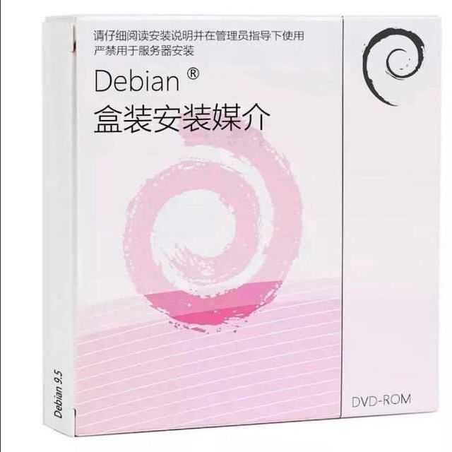

# Debian 小药盒

## 使用

在 release 页面下载 PDF 或其他格式档案，使用 300g 铜版纸的光面打印出 PDF 文档的第一页，之后沿线裁下并粘胶折叠即可。

为了方便制作纸盒，有加入部分辅助线，如果感觉影响美观可以自行删去。

十分欢迎您对本设计提出改进意见，提 issue 和 pr 均可。

## 介绍

这是一个用来包装 Debian 安装介质的盒子的平面设计。因为 Debian 的 logo 与某药品十分相似，此前就有类似的梗，如下图。

这里的设计正与之相同。

## Staff

这个设计的最初稿是由某不愿透露名字的辣鸡嫖虫所描出来的，本 Soha 进行了改进，然后再由辣鸡嫖虫修改所定稿的。

### 感谢

  - dfceaef

## LICENSE

This work is licensed under a [Creative Commons Attribution 2.0 Generic License](http://creativecommons.org/licenses/by/2.0/).
