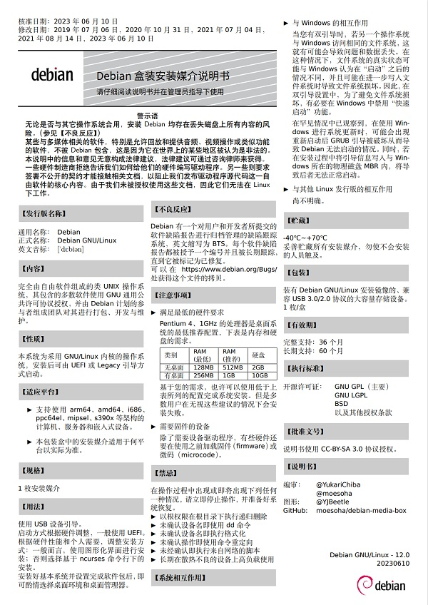

# Debian 小药盒

| 包装盒                     | 说明书                          |
|:-------------------------:|:------------------------------:|
|  |  |

## 使用

在 [release](https://github.com/moesoha/debian-media-box/releases/latest) 页面下载 PDF 或其他格式档案打印即可。

对于包装盒，建议使用足够大的 300g 铜版纸的光面打印出包装盒 TIF 文件（推荐）或者 PDF 文档的第一页，之后沿线裁下并粘胶折叠即可。（注意：喷墨打印机打光面铜版纸很容易掉色。）为了方便制作纸盒，有加入部分辅助线，如果感觉影响美观可以自行删去。

对于说明书，您可以随意选用各种种类的 A4 纸打印。如果想使用其他尺寸的纸张，您可以下载 `instruction.tex`，修改参数重新编译出 PDF 之后再打印。

十分欢迎您对本包装和说明书提出改进建议，提 issue 和 pr 均可。

[关于“严禁用于服务器安装”](https://github.com/moesoha/debian-media-box/issues/1)

## 介绍

这是一个用来包装 Debian 安装介质的盒子的平面设计。因为 Debian 的 logo 与某药品十分相似，此前就有类似的梗，如下图。

这里的设计正与之相同。

## Staff

在此处感谢以下对本项目作出贡献的朋友：

  - 某不愿透露姓名的辣鸡嫖虫 (包装盒初稿)
  - dfceaef (包装盒文案)
  - Soha (包装盒与说明书的终稿)
  - CharlesYang (说明书创意与文案, [#3](https://github.com/moesoha/debian-media-box/issues/3))
  - IcesandSora (包装盒创意)

## LICENSE

本作品采用[知识共享署名-相同方式共享 3.0 未本地化版本许可协议](http://creativecommons.org/licenses/by-sa/3.0/)进行许可。
